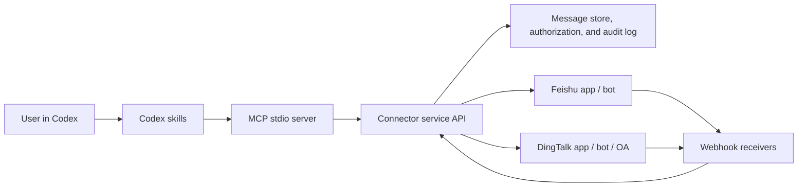

# Architecture

## Recommended Shape

## Boundaries

- Codex plugin: intent routing, workflow rules, safety language, and MCP discovery.
- MCP server: small stateless adapter that validates inputs and calls the connector API.
- Connector service: webhooks, signature checks, token refresh, message normalization, storage, retrieval, summarization hooks, send adapters, history sync, and DingTalk OA approval adapters.
- Storage: normalized messages, conversation authorization metadata, and audit events. The local version stores JSONL files by default or SQLite when `CN_MESSAGING_STORE=sqlite`; production should use a database plus vector or full-text search.
- Group-chat reports: extract key messages, decisions, follow-ups, and risks from bounded message windows. The structure is inspired by chat-report workflows such as `wetrace-skill`.
- Slack-style workflows: daily digest, notification triage, reply candidate detection, draft reply queues, and Markdown summary documents are implemented above the normalized message store so they can work across Feishu/Lark and DingTalk.

## Why This Matches the Slack Pattern

The Slack plugin separates high-level skills from the connected app surface. This plugin keeps the same skill routing shape, but replaces the first-party Slack connector with a controlled Feishu/DingTalk connector service and MCP tools.
