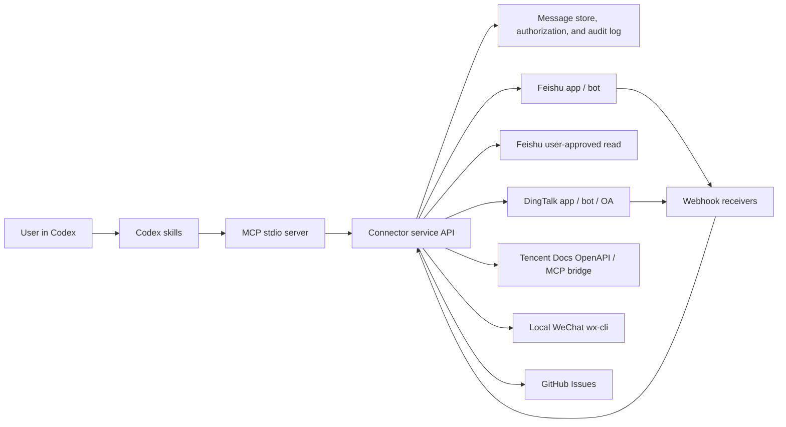

# Architecture

## Recommended Shape

## Boundaries

- Codex plugin: intent routing, workflow rules, safety language, and MCP discovery.
- MCP server: small stateless adapter that validates inputs and calls the connector API.
- Connector service: webhooks, signature checks, token refresh, message normalization, storage, retrieval, summarization hooks, send adapters, history sync, workspace document adapters, native notification-state adapters, and DingTalk OA approval adapters.
- Storage: normalized messages, native thread metadata, cross-platform identity mappings, conversation authorization metadata, scheduled actions, and audit events. The local version stores JSONL files by default or SQLite when `CN_MESSAGING_STORE=sqlite`; production should use a database plus vector or full-text search.
- Group-chat reports: extract key messages, decisions, follow-ups, and risks from bounded message windows. The structure is inspired by chat-report workflows such as `wetrace-skill`.
- Slack-style workflows: daily digest, notification triage, reply candidate detection, draft reply queues, and Markdown summary documents are implemented above the normalized message store so they can work across Feishu/Lark and DingTalk.
- Workspace document layer: summaries and structured data can be published to Feishu/Lark docs/sheets/Base/whiteboards, DingTalk docs/sheets/AI tables, and Tencent Docs resources through connector-side credentials. Writes are dry-run by default.
- Feishu/Lark user read fallback: bot/app access stays first. If it cannot read a group or workspace resource, Codex asks the user before retrying through user permission for that one read.
- Native notification state: platform-native @me, unread conversation/feed, and read-status surfaces are exposed separately from text-based triage so Codex can label evidence correctly.
- Local WeChat layer: `wx-cli` reads local desktop WeChat sessions, unread state, history, search results, and new messages. This layer is read-only and never sends WeChat messages.
- Native/thread layer: the connector preserves platform thread/root/parent ids when adapters expose them, and falls back to inferred topic-centered timelines when native ids are unavailable.
- Identity layer: Feishu/Lark and DingTalk user ids, display names, and aliases can be mapped to one canonical person so triage and reply workflows behave more like Slack's user-aware notification surfaces.
- Schedule layer: scheduled digests and messages are stored as pending records. A worker can call `run_due_scheduled_actions` to preview or execute due records while keeping final sends behind explicit confirmation/audit policy.
- Issue-reporting agent: connector errors can be turned into redacted GitHub Issues. Real automatic creation requires explicit runtime flags; preview mode is the default.

## Why This Matches the Slack Pattern

The Slack plugin separates high-level skills from the connected app surface. This plugin keeps the same skill routing shape, but replaces the first-party Slack connector with a controlled Feishu/DingTalk connector service and MCP tools.
